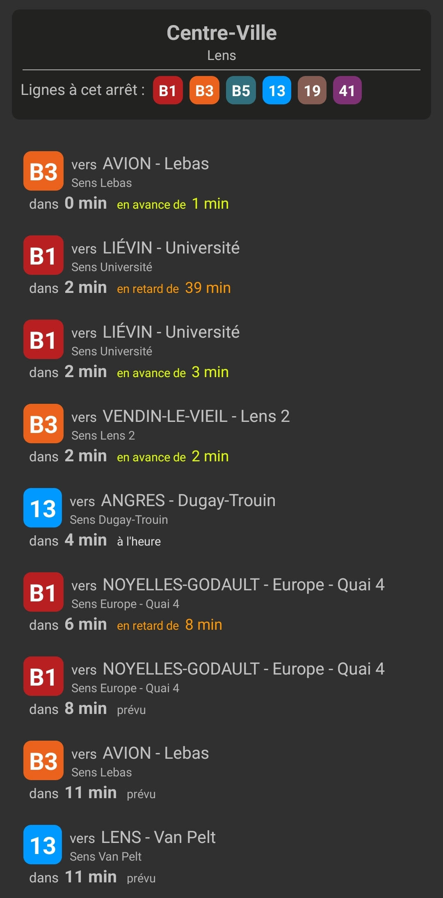

# Tadao App
 

A simple Java Android application to view next departures for stops of the [Tadao](https://tadao.fr/) bus network.

## Showcase

## Features

- Search bus stop by name and/or city
- Next departures in real-time (if data available)

## Download

Get the APK in the [Releases](https://github.com/MeijiRestored/TadaoApp/releases) section.

## Disclaimer

Elements used in this application, mostly the API endpoint, are used for the sole purpose of relaying information, and are believed to fall under fair use. This application's capabilites would be null without them.

This application was designed only as both a developpement challenge and to fullfill a need to access departure information in an easier way, especially since the shutdown of the official app.
